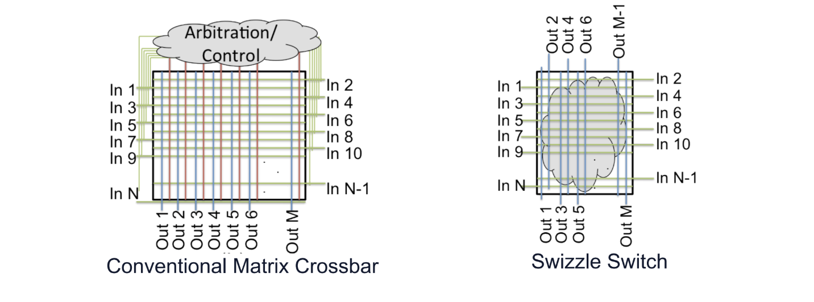
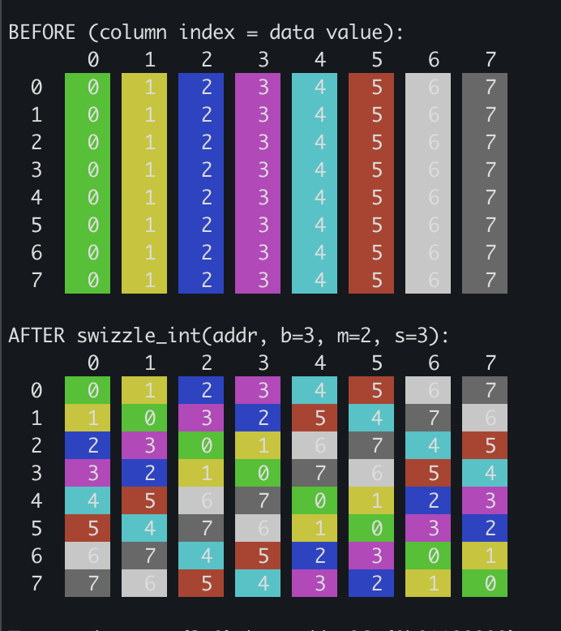

# Swizzling

### The hardware history

The [crossbar switch](https://web.eecs.umich.edu/~tnm/trev_test/papersPDF/2012.8.swizzleHotChips.pdf) is the physical bottleneck connecting processing cores to memory banks. The crossbar is the underlying technology, which handles data access routing, and explains why this problem looks the same regardless of whether you are looking at a [2000s CPU motherboard](https://archive.techarp.com/showFreeBOGc856.html?lang=0&bogno=438) or a modern Nvidia GPU. 



At every single intersection point on this grid (the picture taken from page 3 in that HotChips pdf above), there is a physical switch called a crosspoint. When some input row (a lane) wants to speak with an output column (some memory location), the hardware will close that specific crosspoint. What's great about this design is that InputA can talk with BankA at the same time as InputB talks with BankB. 

The dream, one might think, would be a sort of true multi-ported SRAM, where 32 threads each have their own independent port into the same memory array, so that all reads and writes can occur simultaneously with zero contention. Unfortunately, this approach would require nearly 70 transistors and a bunch of wiring per single SRAM memory cell, and the GPU would run incredibly hot and slow. 

What the crossbar allows for is the illusion of this dream by separating routing complexity from memory capacity. If shared memory grew from 128KB to 256KB, nothing happens to the size of the crossbar whereas for the 32-port dream, you'd need many many more wires. 

Note: We will mainly be speaking to SMEM in this blog, but global memory (using DRAM) conflicts have a fundamentally similar nature, except that DRAM bank conflicts occur when threads access different rows of the same VRAM bank. 

The crossbar works super well until multiple inputs try to retrieve data on the same output column simultaneously. However, multiple inputs are _physically_ unable to both claim access to some column simultaneously, and so the crossbar is forced to engage in some arbitration mechanism for who gets access first. This is a bank conflict.

Now applying that picture to our GPU, we have 32 input lanes (threads in a warp) mapped to 32 output lanes (32 SRAM banks) where the width of a single bank is 4 bytes. To avoid bank conflicts, we always want each thread to drive a different output bank than every other thread.

I like the mental image of 32 filing cabinets (SRAM banks) all next to one another. Each filing cabinet has a single ladder that allows you to access any of its 32 vertically stacked drawers. To get any chunk of data from any given filing cabinet's drawer you need to climb that filing cabinet's ladder. A bank conflict is when I'm asked to grab multiple drawers' data from a single filing cabinet. I only have a single ladder!

But very often you do want a single column's (filing cabinet's) data at the same time. Swizzle math is the solution to wanting to avoid bank conflicts but access the same column data. The key is to alter how data gets initially written into SMEM.

Imagine a Sudoku board where the first column is all 1s, the second column all 2s, etc, up to column 9 (this is obviously an "illegal" Sudoku board). Now overlay in your mind the swizzle switch image from above. If I ask for all of column 1s data (all the 1s), it will take 9 cycles to get all of our 1s data because each row is on the same bank. Now imagine a solved Sudoku puzzle and overlay that same swizzle switch image. Obtaining our 1s now takes a single cycle. The catch is we need to know which column our 1s were moved to. We need a sort of a function that can both write in some "funky" way to SMEM then read in that same "funky" way from SMEM, while keeping the actual data that is accessed invariant.

When we talk of swizzling, this data movement is what we're speaking about. The question is how do we create that "funky" function. 

Let's shrink our problem down a bit to an 8x8 chunk. We want some function that changes the literal address of where some data will be stored then accessed. We know we're really just trying to rearrange row data. And that each memory bank is 4 bytes wide (i.e. 32 bits). So, 8 elements wide * 4 bytes per element * 8 bits per byte == 256 contiguous bits wide.

So, our rows's starting addresses in decimal, hex, and binary would be:
```
row 0:   0 0x00 0b00000000
row 1:  32 0x20 0b00100000
row 2:  64 0x40 0b01000000
row 3:  96 0x60 0b01100000
row 4: 128 0x80 0b10000000
row 5: 160 0xa0 0b10100000
row 6: 192 0xc0 0b11000000
row 7: 224 0xe0 0b11100000
```

Let's focus in on row 1 to try and see any patterns.
```
32 0x20 0b00100000
36 0x24 0b00100100
40 0x28 0b00101000
44 0x2c 0b00101100
48 0x30 0b00110000
52 0x34 0b00110100
56 0x38 0b00111000
60 0x3c 0b00111100
```

Now row 2:
```
64 0x40 0b1000000
68 0x44 0b1000100
72 0x48 0b1001000
76 0x4c 0b1001100
80 0x50 0b1010000
84 0x54 0b1010100
88 0x58 0b1011000
92 0x5c 0b1011100
```

The 2 least significant bits never change; this makes sense because were striding along 4 byte banks.
Only bits 2-4 change. This makes sense, as 2^3 equals 8 which is the number of columns in our chunk. 
So, we want our funky and invertible function to really target the bits 2-4 in our example. The question that is being begged though is what transformation are we to apply to those 3 bits.

If we look back up to starting addresses, bits 2-4 all correspond to the column offset of 0 and bits 5-7 correspond to the rows and are thus all different. We seem to want our bits 2-4 to in part be a function of bits 5-7. What primitives do we have at our disposal.

At base this function needs to be a bijection. This is a function where every input maps to a unique output, and every possible output has exactly one input that maps to it. I.e. the function is one-to-one and onto.

Addition might work. Addition would need an inverse (namely subtraction). If you were to add the row bits into the column bits on write, you would need to deal with carry bits. But this could be handled if on read (subtracting the columns from the row bits) you enounter a negative value. 

The and operation wouldn't work. Consider, `0b01 & 0b10 == 0b01 & 0b00 == 0b00`.
The or operation also wouldn't work. Consider, `0b01 | 0b10 == 0b01 | 0b11 == 0b11`.

XOR is interesting because its self inverting (i.e. `a ^ b ^ b == a`). It's also a single function unlike our add and subtract idea. It also doesn't have a carry problem. Furthermore, if we set a as our row and b as our column, then necessarily `f(a, b) = a ^ b` _must be_ different for the same b and different a. This is exactly to say that using xor as our transformation will bank-conflict-free data access.

Putting this all together, our funky function will be:
On before write into SMEM, an xor function will get applied such that the data that was meant to be written to some address, will be written to the address with the transformation of `column bits = column bits ^ row bits` applied. Reading from SMEM is then simply reading from the address with that same transformation applied.

And this is pretty much the exact logic as to how [cutlass performs](https://github.com/NVIDIA/cutlass/blob/main/python/CuTeDSL/cutlass/cute/nvgpu/warpgroup/helpers.py#L51) their [swizzling math](https://github.com/NVIDIA/cutlass/blob/main/python/CuTeDSL/cutlass/cute/core.py#L1035)!

To visualize what this sort of swizzle might look like as it relates to how the data might be stored into smem, you can run , which is effectively only these lines:

```python
def swizzle_int(addr, b, m, s):
    bit_mask = (1 << b) - 1
    yyy_msk = bit_mask << (m + s)
    return addr ^ ((addr & yyy_msk) >> s)

def addr_to_rc(addr, cols, elem_bytes):
    row_bytes = cols * elem_bytes
    r = addr // row_bytes
    c = (addr % row_bytes) // elem_bytes
    return r, c

ROWS, COLS = 8, 8
ELEM_BYTES = 4

before = np.array([[c for c in range(COLS)] for _ in range(ROWS)])

after = np.full((ROWS, COLS), -1)
for r in range(ROWS):
    for c in range(COLS):
        orig_addr = r * COLS * ELEM_BYTES + c * ELEM_BYTES
        new_addr = swizzle_int(orig_addr, b=3, m=2, s=3)
        nr, nc = addr_to_rc(new_addr, COLS, ELEM_BYTES)
        after[nr][nc] = before[r][c]
```

It's output looks like


